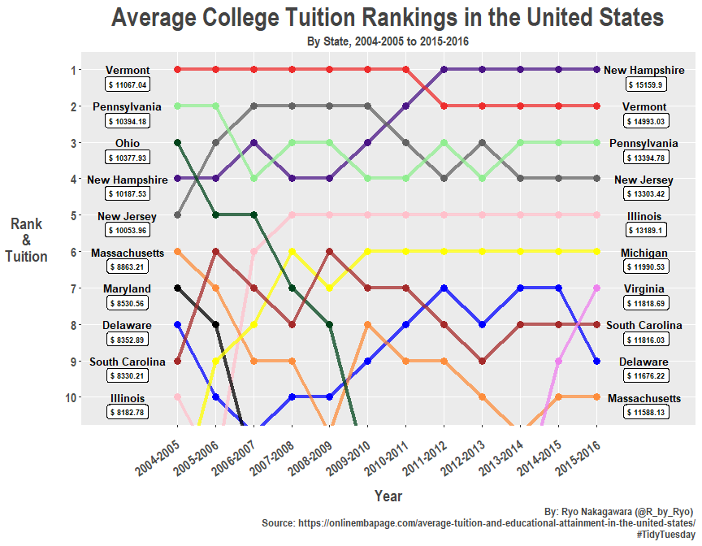
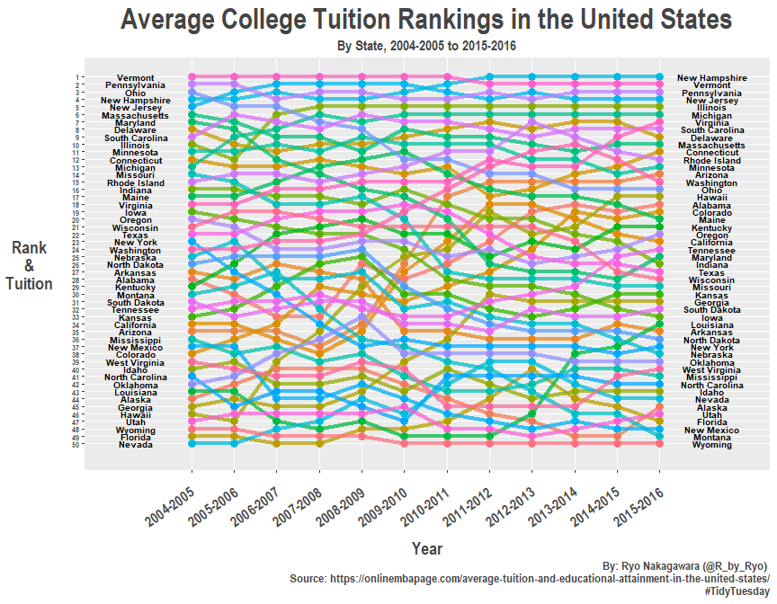

``` r
library(xlsx)
```

    ## Loading required package: rJava

    ## Loading required package: xlsxjars

``` r
library(dplyr)
```

    ## 
    ## Attaching package: 'dplyr'

    ## The following objects are masked from 'package:stats':
    ## 
    ##     filter, lag

    ## The following objects are masked from 'package:base':
    ## 
    ##     intersect, setdiff, setequal, union

``` r
library(stringr)
library(tidyr)
library(ggplot2)
library(scales)
```

load data, check data
=====================

``` r
usa_avg_tuition <- read.xlsx(file = "us_avg_tuition.xlsx", sheetName = "Table 5")

glimpse(usa_avg_tuition)
```

    ## Observations: 50
    ## Variables: 13
    ## $ State       <fct> Alabama, Alaska, Arizona, Arkansas, California, Co...
    ## $ X2004.05    <dbl> 5682.838, 4328.281, 5138.495, 5772.302, 5285.921, ...
    ## $ X2005.06    <dbl> 5840.550, 4632.623, 5415.516, 6082.379, 5527.881, ...
    ## $ X2006.07    <dbl> 5753.496, 4918.501, 5481.419, 6231.977, 5334.826, ...
    ## $ X..2007.08. <dbl> 6008.169, 5069.822, 5681.638, 6414.900, 5672.472, ...
    ## $ X2008.09    <dbl> 6475.092, 5075.482, 6058.464, 6416.503, 5897.888, ...
    ## $ X2009.10    <dbl> 7188.954, 5454.607, 7263.204, 6627.092, 7258.771, ...
    ## $ X2010.11    <dbl> 8071.134, 5759.153, 8839.605, 6900.912, 8193.739, ...
    ## $ X2011.12    <dbl> 8451.902, 5762.421, 9966.716, 7028.991, 9436.426, ...
    ## $ X2012.13    <dbl> 9098.069, 6026.143, 10133.503, 7286.580, 9360.574,...
    ## $ X2013.14    <dbl> 9358.929, 6012.445, 10296.200, 7408.495, 9274.193,...
    ## $ X2014.15    <dbl> 9496.084, 6148.808, 10413.844, 7606.410, 9186.824,...
    ## $ X2015.16    <dbl> 9751.101, 6571.340, 10646.278, 7867.297, 9269.844,...

``` r
colnames(usa_avg_tuition)
```

    ##  [1] "State"       "X2004.05"    "X2005.06"    "X2006.07"    "X..2007.08."
    ##  [6] "X2008.09"    "X2009.10"    "X2010.11"    "X2011.12"    "X2012.13"   
    ## [11] "X2013.14"    "X2014.15"    "X2015.16"

deal with annoying column names ==&gt; regex time!
==================================================

``` r
colnames(usa_avg_tuition) <- colnames(usa_avg_tuition) %>% 
  str_replace_all("X", "") %>% 
  str_replace("\\.", "-20")

# manually change 2007-2008 ...

usa_avg_tuition <- usa_avg_tuition %>% rename(`2007-2008` = `-20.2007.08.`)
```

gather to correct format + create "rank" column
===============================================

``` r
usa_avg_tuition <- usa_avg_tuition %>% gather(key = "year", value = "tuition", -State)

usa_avg_tuition <- usa_avg_tuition %>% 
  arrange(year, desc(tuition)) %>% 
  group_by(year) %>% 
  mutate(rank = dense_rank(desc(tuition)))


usa_avg_tuition <- usa_avg_tuition %>% 
  mutate(state = as.character(State))
```

`pull()` out the top 10 states for start year and end year ==&gt; assign color to them.

``` r
top_states <- usa_avg_tuition %>% 
  filter(year %in% c("2004-2005", "2015-2016") & rank %in% c(1:10)) %>% 
  pull(state) %>% 
  unique()

top_states
```

    ##  [1] "Vermont"        "Pennsylvania"   "Ohio"           "New Hampshire" 
    ##  [5] "New Jersey"     "Massachusetts"  "Maryland"       "Delaware"      
    ##  [9] "South Carolina" "Illinois"       "Michigan"       "Virginia"

``` r
usa_avg_tuition <- usa_avg_tuition %>% 
  mutate(top_tuition = state %in% top_states,
         tuition = round(tuition, digits = 2))

colors = c(
  Vermont = "#EE2C2C",          # red
  Pennsylvania = "lightgreen",        # dark blue
  Ohio = "#00441b",          # green
  `New Hampshire` = "#4a1486",        # purple
  `New Jersey` = "#636363",        # dark grey
  Massachusetts = "#fd8d3c",    # orange
  Maryland = "#000000",          # black
  Delaware = "blue",
  `South Carolina` = "brown",
  Illinois = "pink",
  Michigan = "yellow",
  Virginia = "violet"
)
```

bump chart theme
================

``` r
library(extrafont)
```

    ## Registering fonts with R

``` r
theme_tuition <-  
  theme(text = element_text(family = "Arial Narrow", color = "#444444", face = "bold"),
        plot.title = element_text(size = 24, hjust = 0.5),
        plot.subtitle = element_text(size = 12, hjust = 0.5),
        axis.title = element_text(size = 14),
        axis.title.y = element_text(angle = 0, vjust = 0.5, margin = margin(r = 15)),
        axis.text = element_text(size = 12),
        axis.text.x = element_text(angle = 35, vjust = 1.3, hjust = 1.1,
                                   margin = margin(t = 15, r = 0, b = 0, l = 0)),
        axis.title.x = element_text(margin = margin(t = 8)),
        panel.grid.minor.y = element_blank(),
        legend.title = element_blank(),
        legend.position = "none")
```

the final bump chart
====================

``` r
usa_avg_tuition %>% 
  filter(top_tuition == TRUE) %>% 
  ggplot(aes(year, rank, group = state)) +
  geom_line(aes(color = state), size = 1.6, alpha = 0.75) +
  geom_point(aes(color = state), size = 3, alpha = 1) +
  scale_y_reverse(breaks = 1:10) +         # show only top 10!
  geom_text(data = usa_avg_tuition %>% filter(year == "2004-2005"),
            aes(label = state, x = -0.3), 
            fontface = "bold", color = "black", size = 3.5) +
  geom_label(data = usa_avg_tuition %>% filter(year == "2004-2005"),
            aes(label = paste("$", tuition)), nudge_x = -1.3, nudge_y = -0.4, 
            fontface = "bold", color = "black", size = 2.5) +
  geom_text(data = usa_avg_tuition %>% filter(year == "2015-2016"),
            aes(label = state, x = 13.25), 
            fontface = "bold", color = "black", size = 3.5) +
  geom_label(data = usa_avg_tuition %>% filter(year == "2015-2016"),
             aes(label = paste("$", tuition)), nudge_x = 1.3, nudge_y = -0.4, 
             fontface = "bold", color = "black", size = 2.5) +
  coord_cartesian(ylim = c(1, 10.3), xlim = c(-0.9, 14)) +
  theme_tuition +
  scale_color_manual(values = colors) +
  labs(x = "Year", 
       y = "Rank\n&\nTuition",
       title = "Average College Tuition Rankings in the United States",
       subtitle = "By State, 2004-2005 to 2015-2016",
       caption = "By: Ryo Nakagawara (@R_by_Ryo) \n Source: https://onlinembapage.com/average-tuition-and-educational-attainment-in-the-united-states/\n#TidyTuesday")
```



``` r
# ALL states

usa_avg_tuition %>% 
  ggplot(aes(year, rank, group = state)) +
  geom_line(aes(color = state), size = 1.6, alpha = 0.75) +
  geom_point(aes(color = state), size = 3, alpha = 1) +
  scale_y_reverse(breaks = 1:50) +         # show only top 10!
  geom_text(data = usa_avg_tuition %>% filter(year == "2004-2005"),
            aes(label = state, x = -0.3), 
            fontface = "bold", color = "black", size = 2.7) +
  #geom_label(data = usa_avg_tuition %>% filter(year == "2004-2005"),
            #aes(label = paste("$", tuition)), nudge_x = -1.3, nudge_y = -0.4, 
            #fontface = "bold", color = "black", size = 2.5) +
  geom_text(data = usa_avg_tuition %>% filter(year == "2015-2016"),
            aes(label = state, x = 13.25), 
            fontface = "bold", color = "black", size = 2.7) +
  #geom_label(data = usa_avg_tuition %>% filter(year == "2015-2016"),
             #aes(label = paste("$", tuition)), nudge_x = 1.3, nudge_y = -0.4, 
             #fontface = "bold", color = "black", size = 2.5) +
  coord_cartesian(ylim = c(1, 51), xlim = c(-0.9, 14)) +
  theme_tuition +
  #scale_color_manual(values = colors) +
  labs(x = "Year", 
       y = "Rank\n&\nTuition",
       title = "Average College Tuition Rankings in the United States",
       subtitle = "By State, 2004-2005 to 2015-2016",
       caption = "By: Ryo Nakagawara (@R_by_Ryo) \n Source: https://onlinembapage.com/average-tuition-and-educational-attainment-in-the-united-states/\n#TidyTuesday") +
  theme(axis.text.y = element_text(size = 6.5))
```


